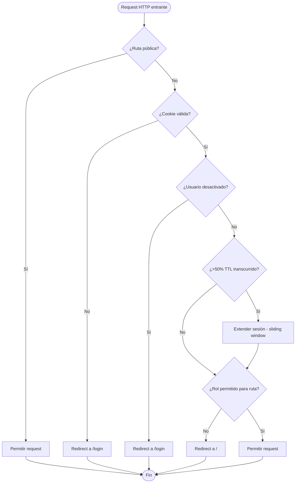
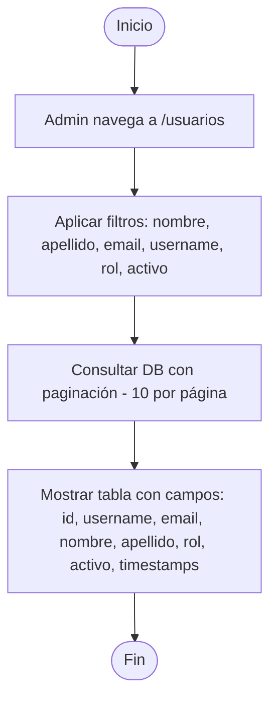
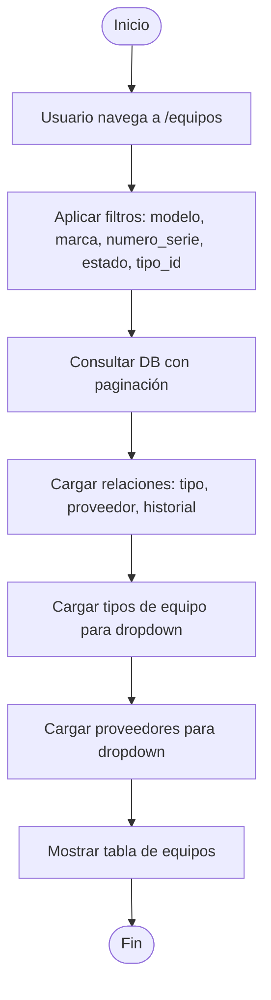

# Diagramas de Casos de Uso — Módulo Mantenimiento de Equipos

> Diagramas UML de casos de uso y diagramas de flujo para cada UC del sistema.
> Formato: Mermaid (se renderiza automáticamente en GitHub/GitLab/VS Code con extensión).
> Versión: 1.0 | Última actualización: 2026-09-08

---

## Índice

1. [Diagrama UML General del Sistema](#1-diagrama-uml-general-del-sistema)
2. [Autenticación y Autorización](#2-autenticación-y-autorización)
3. [Gestión de Usuarios](#3-gestión-de-usuarios)
4. [Gestión de Equipos](#4-gestión-de-equipos)
5. [Tickets/Incidencias](#5-ticketsincidencias)
6. [Mantenimiento Preventivo](#6-mantenimiento-preventivo)
7. [Inventario y Repuestos](#7-inventario-y-repuestos)
8. [Gestión de Proveedores](#8-gestión-de-proveedores)
9. [Reportes, Config, Dashboard, Sesiones](#9-reportes-config-dashboard-sesiones)

---

## 1. Diagrama UML General del Sistema

### 1.1 Vista General — Todos los Dominios

```mermaid
graph TB
    subgraph "Actores"
        Admin["👤 admin"]
        Tecnico["🔧 tecnico"]
        Consultor["📋 consultor"]
    end

    subgraph "Autenticación"
        UC_AUTH1["UC-AUTH-001\nIniciar Sesión"]
        UC_AUTH2["UC-AUTH-002\nCerrar Sesión"]
        UC_AUTH3["UC-AUTH-003\nSolicitar Recuperación"]
        UC_AUTH4["UC-AUTH-004\nRestablecer Contraseña"]
        UC_AUTH5["UC-AUTH-005\nGuard de Autenticación"]
    end

    subgraph "Gestión de Usuarios"
        UC_USER1["UC-USER-001\nListar Usuarios"]
        UC_USER2["UC-USER-002\nCrear Usuario"]
        UC_USER3["UC-USER-003\nActualizar Usuario"]
        UC_USER4["UC-USER-004\nEliminar Usuario"]
    end

    subgraph "Gestión de Equipos"
        UC_EQ1["UC-EQ-001\nListar Equipos"]
        UC_EQ2["UC-EQ-002\nCrear Equipo"]
        UC_EQ3["UC-EQ-003\nActualizar Equipo"]
        UC_EQ4["UC-EQ-004\nEliminar Equipo"]
        UC_EQ5["UC-EQ-005\nTipos de Equipo"]
    end

    subgraph "Tickets"
        UC_TKT1["UC-TKT-001\nListar Tickets"]
        UC_TKT2["UC-TKT-002\nCrear Ticket"]
        UC_TKT3["UC-TKT-003\nActualizar Ticket"]
        UC_TKT4["UC-TKT-004\nEliminar Ticket"]
        UC_TKT5["UC-TKT-005\nAgregar Comentario"]
        UC_TKT6["UC-TKT-006\nSubir Adjunto"]
        UC_TKT7["UC-TKT-007\nEliminar Adjunto"]
    end

    subgraph "Mantenimiento Preventivo"
        UC_PM1["UC-PM-001\nListar Planes"]
        UC_PM2["UC-PM-002\nCrear Plan"]
        UC_PM3["UC-PM-003\nActualizar Plan"]
        UC_PM4["UC-PM-004\nEliminar Plan"]
        UC_PM5["UC-PM-005\nGestionar Tareas"]
        UC_PM6["UC-PM-006\nProgramar Ejecución"]
        UC_PM7["UC-PM-007\nCompletar Ejecución"]
        UC_PM8["UC-PM-008\nCancelar Ejecución"]
        UC_PM9["UC-PM-009\nReprogramar Ejecución"]
    end

    subgraph "Inventario"
        UC_INV1["UC-INV-001\nListar Ítems"]
        UC_INV2["UC-INV-002\nCrear Ítem"]
        UC_INV3["UC-INV-003\nActualizar Ítem"]
        UC_INV4["UC-INV-004\nEliminar Ítem"]
        UC_INV5["UC-INV-005\nRegistrar Movimiento"]
        UC_INV6["UC-INV-006\nVer Movimientos"]
    end

    subgraph "Proveedores"
        UC_SUP1["UC-SUP-001\nListar Proveedores"]
        UC_SUP2["UC-SUP-002\nCrear Proveedor"]
        UC_SUP3["UC-SUP-003\nActualizar Proveedor"]
        UC_SUP4["UC-SUP-004\nEliminar Proveedor"]
    end

    subgraph "Otros"
        UC_RPT1["UC-RPT-001\nVer Reportes"]
        UC_CFG1["UC-CFG-001\nVer Configuración"]
        UC_CFG2["UC-CFG-002\nActualizar Configuración"]
        UC_DB1["UC-DB-001\nVer Dashboard"]
        UC_SES1["UC-SES-001\nVer Sesiones"]
        UC_SES2["UC-SES-002\nRevocar Sesión"]
    end

    %% Admin connections
    Admin --> UC_AUTH1 & UC_AUTH2 & UC_AUTH3 & UC_AUTH4
    Admin --> UC_USER1 & UC_USER2 & UC_USER3 & UC_USER4
    Admin --> UC_EQ1 & UC_EQ2 & UC_EQ3 & UC_EQ4 & UC_EQ5
    Admin --> UC_TKT1 & UC_TKT2 & UC_TKT3 & UC_TKT4 & UC_TKT5 & UC_TKT6 & UC_TKT7
    Admin --> UC_PM1 & UC_PM2 & UC_PM3 & UC_PM4 & UC_PM5 & UC_PM6 & UC_PM7 & UC_PM8 & UC_PM9
    Admin --> UC_INV1 & UC_INV2 & UC_INV3 & UC_INV4 & UC_INV5 & UC_INV6
    Admin --> UC_SUP1 & UC_SUP2 & UC_SUP3 & UC_SUP4
    Admin --> UC_RPT1 & UC_CFG1 & UC_CFG2 & UC_DB1 & UC_SES1 & UC_SES2

    %% Tecnico connections
    Tecnico --> UC_AUTH1 & UC_AUTH2 & UC_AUTH3 & UC_AUTH4
    Tecnico --> UC_EQ1 & UC_EQ2 & UC_EQ3 & UC_EQ4
    Tecnico --> UC_TKT1 & UC_TKT2 & UC_TKT3 & UC_TKT4 & UC_TKT5 & UC_TKT6 & UC_TKT7
    Tecnico --> UC_PM1 & UC_PM2 & UC_PM3 & UC_PM4 & UC_PM5 & UC_PM6 & UC_PM7 & UC_PM8 & UC_PM9
    Tecnico --> UC_INV1 & UC_INV2 & UC_INV3 & UC_INV4 & UC_INV5 & UC_INV6
    Tecnico --> UC_DB1 & UC_SES1 & UC_SES2

    %% Consultor connections
    Consultor --> UC_AUTH1 & UC_AUTH2 & UC_AUTH3 & UC_AUTH4
    Consultor --> UC_EQ1
    Consultor --> UC_TKT1
    Consultor --> UC_PM1
    Consultor --> UC_INV1 & UC_INV6
    Consultor --> UC_SUP1 & UC_RPT1
    Consultor --> UC_DB1 & UC_SES1 & UC_SES2
```



### 1.2 Diagrama UML Clásico (Actores ↔ Use Cases)

```mermaid
useCaseDiagram
    actor "admin" as Admin
    actor "tecnico" as Tecnico
    actor "consultor" as Consultor

    package "Autenticación" {
        usecase "Iniciar Sesión" as UC1
        usecase "Cerrar Sesión" as UC2
        usecase "Solicitar Recuperación" as UC3
        usecase "Restablecer Contraseña" as UC4
    }

    package "Usuarios" {
        usecase "Listar Usuarios" as UC5
        usecase "Crear Usuario" as UC6
        usecase "Actualizar Usuario" as UC7
        usecase "Eliminar Usuario" as UC8
    }

    package "Equipos" {
        usecase "Listar Equipos" as UC9
        usecase "Crear Equipo" as UC10
        usecase "Actualizar Equipo" as UC11
        usecase "Eliminar Equipo" as UC12
        usecase "Gestionar Tipos" as UC13
    }

    package "Tickets" {
        usecase "Listar Tickets" as UC14
        usecase "Crear Ticket" as UC15
        usecase "Actualizar Ticket" as UC16
        usecase "Eliminar Ticket" as UC17
        usecase "Agregar Comentario" as UC18
        usecase "Subir Adjunto" as UC19
        usecase "Eliminar Adjunto" as UC20
    }

    package "Mantenimiento Preventivo" {
        usecase "Listar Planes" as UC21
        usecase "Crear Plan" as UC22
        usecase "Actualizar Plan" as UC23
        usecase "Eliminar Plan" as UC24
        usecase "Gestionar Tareas" as UC25
        usecase "Programar Ejecución" as UC26
        usecase "Completar Ejecución" as UC27
        usecase "Cancelar Ejecución" as UC28
        usecase "Reprogramar Ejecución" as UC29
    }

    package "Inventario" {
        usecase "Listar Ítems" as UC30
        usecase "Crear Ítem" as UC31
        usecase "Actualizar Ítem" as UC32
        usecase "Eliminar Ítem" as UC33
        usecase "Registrar Movimiento" as UC34
        usecase "Ver Movimientos" as UC35
    }

    package "Proveedores" {
        usecase "Listar Proveedores" as UC36
        usecase "Crear Proveedor" as UC37
        usecase "Actualizar Proveedor" as UC38
        usecase "Eliminar Proveedor" as UC39
    }

    package "Otros" {
        usecase "Ver Reportes" as UC40
        usecase "Ver Configuración" as UC41
        usecase "Actualizar Configuración" as UC42
        usecase "Ver Dashboard" as UC43
        usecase "Ver Sesiones" as UC44
        usecase "Revocar Sesión" as UC45
    }

    Admin --> UC1 & UC2 & UC3 & UC4
    Admin --> UC5 & UC6 & UC7 & UC8
    Admin --> UC9 & UC10 & UC11 & UC12 & UC13
    Admin --> UC14 & UC15 & UC16 & UC17 & UC18 & UC19 & UC20
    Admin --> UC21 & UC22 & UC23 & UC24 & UC25 & UC26 & UC27 & UC28 & UC29
    Admin --> UC30 & UC31 & UC32 & UC33 & UC34 & UC35
    Admin --> UC36 & UC37 & UC38 & UC39
    Admin --> UC40 & UC41 & UC42 & UC43 & UC44 & UC45

    Tecnico --> UC1 & UC2 & UC3 & UC4
    Tecnico --> UC9 & UC10 & UC11 & UC12
    Tecnico --> UC14 & UC15 & UC16 & UC17 & UC18 & UC19 & UC20
    Tecnico --> UC21 & UC22 & UC23 & UC24 & UC25 & UC26 & UC27 & UC28 & UC29
    Tecnico --> UC30 & UC31 & UC32 & UC33 & UC34 & UC35
    Tecnico --> UC43 & UC44 & UC45

    Consultor --> UC1 & UC2 & UC3 & UC4
    Consultor --> UC9
    Consultor --> UC14
    Consultor --> UC21
    Consultor --> UC30 & UC35
    Consultor --> UC36
    Consultor --> UC40
    Consultor --> UC43 & UC44 & UC45
```

---

## 2. Autenticación y Autorización

### 2.1 Diagrama UML — Autenticación

```mermaid
useCaseDiagram
    actor "Cualquier Usuario" as User
    actor "admin" as Admin
    actor "tecnico" as Tecnico
    actor "consultor" as Consultor

    package "Autenticación" {
        usecase "UC-AUTH-001\nIniciar Sesión" as AUTH1
        usecase "UC-AUTH-002\nCerrar Sesión" as AUTH2
        usecase "UC-AUTH-003\nSolicitar Recuperación" as AUTH3
        usecase "UC-AUTH-004\nRestablecer Contraseña" as AUTH4
        usecase "UC-AUTH-005\nGuard de Autenticación" as AUTH5
    }

    User --> AUTH1
    User --> AUTH2
    User --> AUTH3
    User --> AUTH4

    AUTH1 ..> AUTH5 : <<include>>
    AUTH2 ..> AUTH5 : <<include>>
```

### 2.2 Flujo — UC-AUTH-001: Iniciar Sesión

```mermaid
flowchart TD
    Start([Inicio]) --> A[Usuario ingresa a /login]
    A --> B{¿Tiene sesión activa?}
    B -- Sí --> C[Redirect a /]
    B -- No --> D[Usuario ingresa username y password]
    D --> E{¿Cuenta desactivada?}
    E -- Sí --> F[Error: "Cuenta desactivada"]
    E -- No --> G{¿Rate limiting?}
    G -- Sí (>5 intentos/15min) --> H[HTTP 429: "Demasiados intentos"]
    G -- No --> I{¿Credenciales válidas?}
    I -- No --> J[Incrementar contador fallidos]
    J --> K[Error: "Credenciales inválidas"]
    I -- Sí --> L[Generar token UUID]
    L --> M[Crear sesión en DB - TTL 24h]
    M --> N[Establecer cookie httponly]
    N --> O[Redirect a /]
    O --> End([Fin])
    C --> End
    F --> End
    H --> End
    K --> End
```

### 2.3 Flujo — UC-AUTH-002: Cerrar Sesión

```mermaid
flowchart TD
    Start([Inicio]) --> A[Usuario presiona "Cerrar sesión"]
    A --> B[Eliminar sesión de DB]
    B --> C[Borrar cookie]
    C --> D[Redirect a /login]
    D --> End([Fin])
```

### 2.4 Flujo — UC-AUTH-003: Solicitar Recuperación de Contraseña

```mermaid
flowchart TD
    Start([Inicio]) --> A[Usuario ingresa a /auth/forgot-password]
    A --> B[Ingresa username]
    B --> C{¿Rate limiting?}
    C -- Sí (>3 intentos/15min) --> D[Error: "Límite excedido"]
    C -- No --> E{¿Usuario existe?}
    E -- No --> F[Error: "Usuario no encontrado"]
    E -- Sí --> G[Redirect a /auth/reset-password?username=X]
    G --> End([Fin])
    D --> End
    F --> End
```

### 2.5 Flujo — UC-AUTH-004: Restablecer Contraseña

```mermaid
flowchart TD
    Start([Inicio]) --> A[Usuario en /auth/reset-password]
    A --> B[Ingresa: respuesta1, respuesta2, nueva contraseña, confirmación]
    B --> C{¿Rate limiting?}
    C -- Sí --> D[Error: "Límite excedido"]
    C -- No --> E{¿Respuestas correctas?}
    E -- No --> F[Error: "Respuestas incorrectas"]
    E -- Sí --> G{¿Contraseñas coinciden?}
    G -- No --> H[Error: "Las contraseñas no coinciden"]
    G -- Sí --> I{¿Fortaleza OK? (6-128 chars)}
    I -- No --> J[Error: "Contraseña débil"]
    I -- Sí --> K[Hash nueva contraseña - bcrypt]
    K --> L[Actualizar usuario en DB]
    L --> M[Invalidar TODAS las sesiones del usuario]
    M --> N[Redirect a /login]
    N --> End([Fin])
    D --> End
    F --> End
    H --> End
    J --> End
```

### 2.6 Flujo — UC-AUTH-005: Guard de Autenticación



---

## 3. Gestión de Usuarios

### 3.1 Diagrama UML — Usuarios

```mermaid
useCaseDiagram
    actor "admin" as Admin

    package "Gestión de Usuarios" {
        usecase "UC-USER-001\nListar Usuarios" as USER1
        usecase "UC-USER-002\nCrear Usuario" as USER2
        usecase "UC-USER-003\nActualizar Usuario" as USER3
        usecase "UC-USER-004\nEliminar Usuario" as USER4
    }

    Admin --> USER1 & USER2 & USER3 & USER4

    USER4 ..> USER4_REFC : <<include>>
    note right of USER4_REFC : No puede eliminar\núltimo admin activo
    usecase "Verificar último admin" as USER4_REFC
```

### 3.2 Flujo — UC-USER-001: Listar Usuarios



### 3.3 Flujo — UC-USER-002: Crear Usuario

```mermaid
flowchart TD
    Start([Inicio]) --> A[Admin completa formulario]
    A --> B{¿Campos requeridos OK?}
    B -- No --> C[Error por campo faltante]
    B -- Sí --> D{¿Username único?}
    D -- No --> E[Error: "Username en uso"]
    D -- Sí --> F{¿Email único?}
    F -- No --> G[Error: "Email registrado"]
    F -- Sí --> H{¿Email formato válido?}
    H -- No --> I[Error: "Email inválido"]
    H -- Sí --> J{¿Rol válido?}
    J -- No --> K[Error: "Rol inválido"]
    J -- Sí --> L{¿Password 6-128 chars?}
    L -- No --> M[Error: "Contraseña débil"]
    L -- Sí --> N[Hash password bcrypt]
    N --> O[Hash respuestas de seguridad]
    O --> P[Insertar usuario en DB]
    P --> End([Fin])
    C --> End
    E --> End
    G --> End
    I --> End
    K --> End
    M --> End
```

### 3.4 Flujo — UC-USER-003: Actualizar Usuario

```mermaid
flowchart TD
    Start([Inicio]) --> A[Admin edita campos]
    A --> B{¿Username inmutable?}
    B -- Intenta cambiar --> C[Error: "Username no se puede cambiar"]
    B -- Mantiene --> D{¿Email único - excluyendo actual?}
    D -- No --> E[Error: "Email en uso"]
    D -- Sí --> F{¿Nueva contraseña ingresada?}
    F -- Sí --> G[Hash nueva contraseña]
    F -- No --> H[Mantener contraseña actual]
    G --> I{¿Respuestas seguridad vacías?}
    H --> I
    I -- Sí --> J[Mantener respuestas actuales]
    I -- No --> K[Hash nuevas respuestas]
    J --> L{¿Es último admin activo?}
    K --> L
    L -- Sí, desactivando/cambiando rol --> M[Error: "No se puede modificar último admin"]
    L -- No --> N[Actualizar usuario en DB]
    N --> End([Fin])
    C --> End
    E --> End
    M --> End
```

### 3.5 Flujo — UC-USER-004: Eliminar Usuario

```mermaid
flowchart TD
    Start([Inicio]) --> A[Admin solicita eliminar usuario]
    A --> B{¿Es el usuario actual?}
    B -- Sí --> C[Error: "No podés eliminarte a vos mismo"]
    B -- No --> D{¿Es último admin activo?}
    D -- Sí --> E[Error: "No se puede eliminar último admin"]
    D -- No --> F{¿Tiene tickets?}
    F -- Sí --> G[Error: "Tiene X tickets asociados"]
    F -- No --> H{¿Tiene ejecuciones MP?}
    H -- Sí --> I[Error: "Tiene X ejecuciones MP"]
    H -- No --> J{¿Tiene actividad?}
    J -- Sí --> K[Error: "Tiene X registros de actividad"]
    J -- No --> L[Eliminar usuario - hard delete]
    L --> End([Fin])
    C --> End
    E --> End
    G --> End
    I --> End
    K --> End
```

---

## 4. Gestión de Equipos

### 4.1 Diagrama UML — Equipos

```mermaid
useCaseDiagram
    actor "admin" as Admin
    actor "tecnico" as Tecnico
    actor "consultor" as Consultor

    package "Gestión de Equipos" {
        usecase "UC-EQ-001\nListar Equipos" as EQ1
        usecase "UC-EQ-002\nCrear Equipo" as EQ2
        usecase "UC-EQ-003\nActualizar Equipo" as EQ3
        usecase "UC-EQ-004\nEliminar Equipo" as EQ4
        usecase "UC-EQ-005\nTipos de Equipo" as EQ5
    }

    Admin --> EQ1 & EQ2 & EQ3 & EQ4 & EQ5
    Tecnico --> EQ1 & EQ2 & EQ3 & EQ4
    Consultor --> EQ1

    EQ3 ..> EQ3_SM : <<include>>
    note right of EQ3_SM : Validar transición\ncon state machine
    usecase "Validar transición\nde estado" as EQ3_SM
```

### 4.2 Flujo — UC-EQ-001: Listar Equipos



### 4.3 Flujo — UC-EQ-002: Crear Equipo

```mermaid
flowchart TD
    Start([Inicio]) --> A[Usuario completa formulario]
    A --> B{¿Campos requeridos OK?}
    B -- No --> C[Error por campo faltante]
    B -- Sí --> D{¿numero_serie proporcionado?}
    D -- Sí --> E{¿Es único?}
    E -- No --> F[Error: "Serial duplicado"]
    E -- Sí --> G[Insertar equipo en DB]
    D -- No --> G
    G --> End([Fin])
    C --> End
    F --> End
```

### 4.4 Flujo — UC-EQ-003: Actualizar Equipo

```mermaid
flowchart TD
    Start([Inicio]) --> A[Usuario edita campos]
    A --> B{¿Cambia estado?}
    B -- No --> I[Actualizar equipo]
    B -- Sí --> C{¿Transición válida?}
    C -- No --> D[Error: "Transición no permitida"]
    C -- Sí --> E{¿Target es dado_de_baja?}
    E -- Sí --> F{¿Rol es admin?}
    F -- No --> G[Error: "Solo admin puede dar de baja"]
    F -- Sí --> H[Registrar en equipment_status_history]
    E -- No --> H
    H --> I
    I --> End([Fin])
    D --> End
    G --> End
```

### 4.5 Flujo — UC-EQ-004: Eliminar Equipo

```mermaid
flowchart TD
    Start([Inicio]) --> A[Usuario solicita eliminar equipo]
    A --> B{¿Tiene tickets asociados?}
    B -- Sí --> C[Error: "Tiene X tickets"]
    B -- No --> D{¿Tiene planes MP?}
    D -- Sí --> E[Error: "Tiene X planes MP"]
    D -- No --> F[Eliminar equipo]
    F --> End([Fin])
    C --> End
    E --> End
```

### 4.6 Flujo — UC-EQ-005: Tipos de Equipo (CRUD)

```mermaid
flowchart TD
    Start([Inicio]) --> A{¿Operación?}
    A -- Crear --> B{¿Nombre único?}
    B -- No --> C[Error: "Nombre en uso"]
    B -- Sí --> D[Insertar tipo]
    A -- Actualizar --> E{¿Nombre único - excluyendo actual?}
    E -- No --> F[Error: "Nombre en uso"]
    E -- Sí --> G[Actualizar tipo]
    A -- Eliminar --> H{¿Algún equipo usa este tipo?}
    H -- Sí --> I[Error: "Tiene equipos asociados"]
    H -- No --> J[Eliminar tipo]
    D --> End([Fin])
    G --> End
    J --> End
    C --> End
    F --> End
    I --> End
```

---

## 5. Tickets/Incidencias

### 5.1 Diagrama UML — Tickets

```mermaid
useCaseDiagram
    actor "admin" as Admin
    actor "tecnico" as Tecnico
    actor "consultor" as Consultor

    package "Tickets" {
        usecase "UC-TKT-001\nListar Tickets" as TKT1
        usecase "UC-TKT-002\nCrear Ticket" as TKT2
        usecase "UC-TKT-003\nActualizar Ticket" as TKT3
        usecase "UC-TKT-004\nEliminar Ticket" as TKT4
        usecase "UC-TKT-005\nAgregar Comentario" as TKT5
        usecase "UC-TKT-006\nSubir Adjunto" as TKT6
        usecase "UC-TKT-007\nEliminar Adjunto" as TKT7
    }

    Admin --> TKT1 & TKT2 & TKT3 & TKT4 & TKT5 & TKT6 & TKT7
    Tecnico --> TKT1 & TKT2 & TKT3 & TKT4 & TKT5 & TKT6 & TKT7
    Consultor --> TKT1

    TKT3 ..> TKT3_SM : <<include>>
    note right of TKT3_SM : Validar transición\ncon role guard
    usecase "Validar transición\ncon role guard" as TKT3_SM
```

### 5.2 Flujo — UC-TKT-001: Listar Tickets

```mermaid
flowchart TD
    Start([Inicio]) --> A[Usuario navega a /tickets]
    A --> B[Aplicar filtros: titulo, descripcion, numero_ticket, estado, prioridad]
    B --> C[Consultar DB con paginación]
    C --> C1[Cargar relaciones: reporta, asignado, equipo]
    C1 --> C2[Cargar comentarios y adjuntos]
    C2 --> C3[Cargar activity log]
    C3 --> C4[Cargar técnicos y equipos para dropdowns]
    C4 --> D[Mostrar tabla de tickets]
    D --> End([Fin])
```

### 5.3 Flujo — UC-TKT-002: Crear Ticket

```mermaid
flowchart TD
    Start([Inicio]) --> A[Usuario completa formulario]
    A --> B{¿Campos requeridos OK?}
    B -- No --> C[Error por campo faltante]
    B -- Sí --> D{¿equipo_id proporcionado?}
    D -- Sí --> E{¿Equipo existe y NO dado de baja?}
    E -- No --> F[Error: "Equipo dado de baja o inexistente"]
    E -- Sí --> G[Generar número: TKT-YYYYMMDD-NNN]
    D -- No --> G
    G --> H{¿fecha_limite proporcionada?}
    H -- Sí --> I[Usar fecha explícita]
    H -- No --> J[Calcular SLA según prioridad]
    J --> J1{Prioridad}
    J1 -- critica --> J2[f + 1 día]
    J1 -- alta --> J3[f + 3 días]
    J1 -- media --> J4[f + 7 días]
    J1 -- baja --> J5[f + 14 días]
    J2 --> K[Crear ticket]
    J3 --> K
    J4 --> K
    J5 --> K
    I --> K
    K --> L[Registrar activity: crear]
    L --> End([Fin])
    C --> End
    F --> End
```

### 5.4 Flujo — UC-TKT-003: Actualizar Ticket

```mermaid
flowchart TD
    Start([Inicio]) --> A[Usuario edita campos]
    A --> B{¿Cambia estado?}
    B -- No --> H{¿Cambia prioridad?}
    B -- Sí --> C{¿Transición válida?}
    C -- No --> D[Error: "Transición no permitida"]
    C -- Sí --> E{¿Rol permite target?}
    E -- No --> F[Error: "Sin permiso para este estado"]
    E -- Sí --> G[Registrar transición en activity]
    G --> H
    H -- Sí, sin fecha_limite explícita --> I[Recalcular SLA desde hoy]
    H -- No --> J{¿Cambia equipo?}
    I --> J
    J -- Sí --> K{¿Equipo válido?}
    K -- No --> L[Error: "Equipo dado de baja"]
    K -- Sí --> M[Actualizar ticket]
    J -- No --> M
    M --> End([Fin])
    D --> End
    F --> End
    L --> End
```

### 5.5 Flujo — UC-TKT-004: Eliminar Ticket

```mermaid
flowchart TD
    Start([Inicio]) --> A[Usuario solicita eliminar ticket]
    A --> B{¿Es reportador o admin?}
    B -- No --> C[Error: "Sin permiso"]
    B -- Sí --> D[Eliminar archivos adjuntos del disco]
    D --> E[Eliminar ticket de DB]
    E --> F[Registrar activity: eliminar]
    F --> End([Fin])
    C --> End
```

### 5.6 Flujo — UC-TKT-005: Agregar Comentario

```mermaid
flowchart TD
    Start([Inicio]) --> A[Usuario escribe comentario]
    A --> B{¿Contenido no vacío?}
    B -- No --> C[Error: "Comentario vacío"]
    B -- Sí --> D[Guardar comentario en DB]
    D --> E[Registrar activity: comentario]
    E --> End([Fin])
    C --> End
```

### 5.7 Flujo — UC-TKT-006: Subir Adjunto

```mermaid
flowchart TD
    Start([Inicio]) --> A[Usuario selecciona archivo]
    A --> B{¿Tamaño <= 5MB?}
    B -- No --> C[Error: "Archivo excede 5MB"]
    B -- Sí --> D{¿MIME type permitido?}
    D -- No --> E[Error: "Tipo no permitido"]
    D -- Sí --> F[Generar nombre: UUID-filename_saneado]
    F --> G[Guardar en uploads/]
    G --> H[Registrar en DB]
    H --> I[Registrar activity: adjunto]
    I --> End([Fin])
    C --> End
    E --> End
```

### 5.8 Flujo — UC-TKT-007: Eliminar Adjunto

```mermaid
flowchart TD
    Start([Inicio]) --> A[Usuario solicita eliminar adjunto]
    A --> B{¿Es uploader o admin?}
    B -- No --> C[Error: "Sin permiso"]
    B -- Sí --> D[Eliminar archivo del disco - best-effort]
    D --> E[Eliminar registro de DB]
    E --> F[Registrar activity: adjunto_eliminado]
    F --> End([Fin])
    C --> End
```

---

## 6. Mantenimiento Preventivo

### 6.1 Diagrama UML — Mantenimiento Preventivo

```mermaid
useCaseDiagram
    actor "admin" as Admin
    actor "tecnico" as Tecnico
    actor "consultor" as Consultor

    package "Mantenimiento Preventivo" {
        usecase "UC-PM-001\nListar Planes" as PM1
        usecase "UC-PM-002\nCrear Plan" as PM2
        usecase "UC-PM-003\nActualizar Plan" as PM3
        usecase "UC-PM-004\nEliminar Plan" as PM4
        usecase "UC-PM-005\nGestionar Tareas" as PM5
        usecase "UC-PM-006\nProgramar Ejecución" as PM6
        usecase "UC-PM-007\nCompletar Ejecución" as PM7
        usecase "UC-PM-008\nCancelar Ejecución" as PM8
        usecase "UC-PM-009\nReprogramar Ejecución" as PM9
    }

    Admin --> PM1 & PM2 & PM3 & PM4 & PM5 & PM6 & PM7 & PM8 & PM9
    Tecnico --> PM1 & PM2 & PM3 & PM4 & PM5 & PM6 & PM7 & PM8 & PM9
    Consultor --> PM1

    PM7 ..> PM7_STOCK : <<include>>
    note right of PM7_STOCK : Validar stock\nantes de ajustar
    usecase "Validar stock\nde repuestos" as PM7_STOCK
```

### 6.2 Flujo — UC-PM-001: Listar Planes

```mermaid
flowchart TD
    Start([Inicio]) --> A[Usuario navega a /mantenimiento]
    A --> B[Cargar planes con tareas ordenadas]
    B --> C[Cargar ejecuciones ordenadas por fecha]
    C --> D[Contar ejecuciones atrasadas]
    D --> E[Cargar dropdowns: equipos, tipos, técnicos, inventario]
    E --> F[Mostrar vista de planes]
    F --> End([Fin])
```

### 6.3 Flujo — UC-PM-002: Crear Plan

```mermaid
flowchart TD
    Start([Inicio]) --> A{¿Rol es consultor?}
    A -- Sí --> B[Error 403: Acceso denegado]
    A -- No --> C[Usuario completa formulario]
    C --> D{¿nombre y frecuencia_dias OK?}
    D -- No --> E[Error de validación]
    D -- Sí --> F{¿frecuencia_dias > 0?}
    F -- No --> G[Error: "Frecuencia debe ser > 0"]
    F -- Sí --> H{¿equipo_id proporcionado?}
    H -- Sí --> I{¿Equipo existe?}
    I -- No --> J[Error: "Equipo inexistente"]
    I -- Sí --> K[Insertar plan]
    H -- No --> K
    K --> End([Fin])
    B --> End
    E --> End
    G --> End
    J --> End
```

### 6.4 Flujo — UC-PM-003: Actualizar Plan

```mermaid
flowchart TD
    Start([Inicio]) --> A{¿Rol es consultor?}
    A -- Sí --> B[Error 403]
    A -- No --> C[Usuario edita campos]
    C --> D[Validar mismas reglas que creación]
    D --> E[Actualizar plan en DB]
    E --> End([Fin])
    B --> End
```

### 6.5 Flujo — UC-PM-004: Eliminar Plan

```mermaid
flowchart TD
    Start([Inicio]) --> A{¿Rol es consultor?}
    A -- Sí --> B[Error 403]
    A -- No --> C{¿Plan tiene ejecuciones?}
    C -- Sí --> D[Error: "Tiene ejecuciones registradas"]
    C -- No --> E[Eliminar plan]
    E --> End([Fin])
    B --> End
    D --> End
```

### 6.6 Flujo — UC-PM-005: Gestionar Tareas

```mermaid
flowchart TD
    Start([Inicio]) --> A{¿Operación?}
    A -- Agregar --> B{¿Rol consultor?}
    B -- Sí --> C[Error 403]
    B -- No --> D{¿nombre OK?}
    D -- No --> E[Error de validación]
    D -- Sí --> F[Calcular orden: MAX+1]
    F --> G[Insertar tarea]
    A -- Actualizar --> H{¿Rol consultor?}
    H -- Sí --> C
    H -- No --> I[Validar nombre]
    I --> J[Actualizar tarea]
    A -- Eliminar --> K{¿Rol consultor?}
    K -- Sí --> C
    K -- No --> L{¿Tarea tiene ejecuciones?}
    L -- Sí --> M[Error: "Tiene ejecuciones"]
    L -- No --> N[Eliminar tarea]
    G --> End([Fin])
    J --> End
    N --> End
    C --> End
    E --> End
    M --> End
```

### 6.7 Flujo — UC-PM-006: Programar Ejecución

```mermaid
flowchart TD
    Start([Inicio]) --> A{¿Rol consultor?}
    A -- Sí --> B[Error 403]
    A -- No --> C[Seleccionar plan, técnico, fecha]
    C --> D{¿Plan tiene tareas?}
    D -- No --> E[Error: "Plan sin tareas"]
    D -- Sí --> F{¿Fecha >= hoy?}
    F -- No --> G[Error: "Fecha en el pasado"]
    F -- Sí --> H[Crear 1 ejecución por tarea]
    H --> I[Todas con resultado: pendiente]
    I --> End([Fin])
    B --> End
    E --> End
    G --> End
```

### 6.8 Flujo — UC-PM-007: Completar Ejecución

```mermaid
flowchart TD
    Start([Inicio]) --> A{¿Rol consultor?}
    A -- Sí --> B[Error 403]
    A -- No --> C{¿Estado es pendiente?}
    C -- No --> D[Error: "Solo pendientes"]
    C -- Sí --> E[Seleccionar resultado: completado/fallido/omitido]
    E --> F[Registrar observaciones]
    F --> G{¿Usa repuestos?}
    G -- No --> O[Iniciar transacción atómica]
    G -- Sí --> H[Para cada repuesto]
    H --> I{¿Stock suficiente?}
    I -- No --> J[Error: "Stock insuficiente"]
    I -- Sí --> K[Validar siguiente repuesto]
    K --> L{¿Más repuestos?}
    L -- Sí --> I
    L -- No --> O
    O --> P[Actualizar ejecución]
    P --> Q[Ajustar stock de cada repuesto]
    Q --> R[Crear inventory_movements]
    R --> S[Auto-programar próxima ejecución]
    S --> T{¿Ya existe ejecución para próxima fecha?}
    T -- Sí --> U[No duplicar]
    T -- No --> V[Crear nueva ejecución pendiente]
    U --> End([Fin])
    V --> End
    B --> End
    D --> End
    J --> End
```

### 6.9 Flujo — UC-PM-008: Cancelar Ejecución

```mermaid
flowchart TD
    Start([Inicio]) --> A{¿Rol consultor?}
    A -- Sí --> B[Error 403]
    A -- No --> C{¿Estado es pendiente?}
    C -- No --> D[Error: "Solo pendientes"]
    C -- Sí --> E[Set resultado: cancelada]
    E --> End([Fin])
    B --> End
    D --> End
```

### 6.10 Flujo — UC-PM-009: Reprogramar Ejecución

```mermaid
flowchart TD
    Start([Inicio]) --> A{¿Rol consultor?}
    A -- Sí --> B[Error 403]
    A -- No --> C{¿Estado es pendiente?}
    C -- No --> D[Error: "Solo pendientes"]
    C -- Sí --> E{¿Nueva fecha >= hoy?}
    E -- No --> F[Error: "Fecha en el pasado"]
    E -- Sí --> G[Actualizar fecha_programada]
    G --> End([Fin])
    B --> End
    D --> End
    F --> End
```

---

## 7. Inventario y Repuestos

### 7.1 Diagrama UML — Inventario

```mermaid
useCaseDiagram
    actor "admin" as Admin
    actor "tecnico" as Tecnico
    actor "consultor" as Consultor

    package "Inventario" {
        usecase "UC-INV-001\nListar Ítems" as INV1
        usecase "UC-INV-002\nCrear Ítem" as INV2
        usecase "UC-INV-003\nActualizar Ítem" as INV3
        usecase "UC-INV-004\nEliminar Ítem" as INV4
        usecase "UC-INV-005\nRegistrar Movimiento" as INV5
        usecase "UC-INV-006\nVer Movimientos" as INV6
    }

    Admin --> INV1 & INV2 & INV3 & INV4 & INV5 & INV6
    Tecnico --> INV1 & INV2 & INV3 & INV4 & INV5 & INV6
    Consultor --> INV1 & INV6

    INV5 ..> INV5_STOCK : <<include>>
    note right of INV5_STOCK : Validar stock\nen transacción atómica
    usecase "Validar stock\nen transacción" as INV5_STOCK
```

### 7.2 Flujo — UC-INV-001: Listar Ítems

```mermaid
flowchart TD
    Start([Inicio]) --> A[Usuario navega a /inventario]
    A --> B[Aplicar filtros: nombre, codigo_parte, categoria, tipo, stock_bajo]
    B --> C[Consultar DB con paginación]
    C --> D[Cargar categorías, tipos, conteo stock bajo]
    D --> E[Mostrar tabla de inventario]
    E --> End([Fin])
```

### 7.3 Flujo — UC-INV-002: Crear Ítem

```mermaid
flowchart TD
    Start([Inicio]) --> A{¿Rol consultor?}
    A -- Sí --> B[Error 403]
    A -- No --> C[Usuario completa formulario]
    C --> D{¿Campos requeridos OK?}
    D -- No --> E[Error de validación]
    D -- Sí --> F{¿codigo_parte único?}
    F -- No --> G[Error: "Código en uso"]
    F -- Sí --> H[Insertar ítem]
    H --> End([Fin])
    B --> End
    E --> End
    G --> End
```

### 7.4 Flujo — UC-INV-003: Actualizar Ítem

```mermaid
flowchart TD
    Start([Inicio]) --> A{¿Rol consultor?}
    A -- Sí --> B[Error 403]
    A -- No --> C[Usuario edita campos]
    C --> D[Validar mismas reglas que creación]
    D --> E[Actualizar ítem]
    E --> End([Fin])
    B --> End
```

### 7.5 Flujo — UC-INV-004: Eliminar Ítem

```mermaid
flowchart TD
    Start([Inicio]) --> A{¿Rol consultor?}
    A -- Sí --> B[Error 403]
    A -- No --> C{¿Ítem tiene movimientos?}
    C -- Sí --> D[Error: "Tiene X movimientos"]
    C -- No --> E[Eliminar ítem]
    E --> End([Fin])
    B --> End
    D --> End
```

### 7.6 Flujo — UC-INV-005: Registrar Movimiento

```mermaid
flowchart TD
    Start([Inicio]) --> A{¿Rol consultor?}
    A -- Sí --> B[Error 403]
    A -- No --> C[Seleccionar ítem, tipo, cantidad, motivo]
    C --> D{¿cantidad > 0?}
    D -- No --> E[Error: "Cantidad debe ser > 0"]
    D -- Sí --> F{¿Tipo de movimiento?}
    F -- entrada --> G[stock += cantidad]
    F -- salida --> H{¿Stock suficiente?}
    H -- No --> I[Error: "Stock insuficiente"]
    H -- Sí --> J[stock -= cantidad]
    F -- ajuste --> K[stock = cantidad]
    G --> L[Transacción atómica]
    J --> L
    K --> L
    L --> M[Crear registro de movimiento]
    M --> N[Actualizar stock_actual]
    N --> End([Fin])
    B --> End
    E --> End
    I --> End
```

### 7.7 Flujo — UC-INV-006: Ver Movimientos

```mermaid
flowchart TD
    Start([Inicio]) --> A[Usuario navega a /inventario/movimientos]
    A --> B[Aplicar filtros: ítem, tipo]
    B --> C[Consultar DB con paginación - más reciente primero]
    C --> D[Mostrar tabla de movimientos]
    D --> End([Fin])
```

---

## 8. Gestión de Proveedores

### 8.1 Diagrama UML — Proveedores

```mermaid
useCaseDiagram
    actor "admin" as Admin
    actor "consultor" as Consultor

    package "Gestión de Proveedores" {
        usecase "UC-SUP-001\nListar Proveedores" as SUP1
        usecase "UC-SUP-002\nCrear Proveedor" as SUP2
        usecase "UC-SUP-003\nActualizar Proveedor" as SUP3
        usecase "UC-SUP-004\nEliminar Proveedor" as SUP4
    }

    Admin --> SUP1 & SUP2 & SUP3 & SUP4
    Consultor --> SUP1
```

### 8.2 Flujo — UC-SUP-001: Listar Proveedores

```mermaid
flowchart TD
    Start([Inicio]) --> A[Usuario navega a /proveedores]
    A --> B[Aplicar filtros: nombre, contacto]
    B --> C[Consultar DB con paginación]
    C --> D[Mostrar tabla de proveedores]
    D --> End([Fin])
```

### 8.3 Flujo — UC-SUP-002: Crear Proveedor

```mermaid
flowchart TD
    Start([Inicio]) --> A[Admin completa formulario]
    A --> B{¿nombre requerido OK?}
    B -- No --> C[Error: "Nombre requerido"]
    B -- Sí --> D{¿email proporcionado?}
    D -- Sí --> E{¿Formato válido?}
    E -- No --> F[Error: "Email inválido"]
    E -- Sí --> G[Insertar proveedor]
    D -- No --> G
    G --> End([Fin])
    C --> End
    F --> End
```

### 8.4 Flujo — UC-SUP-003: Actualizar Proveedor

```mermaid
flowchart TD
    Start([Inicio]) --> A[Admin edita campos]
    A --> B[Validar nombre y email]
    B --> C[Actualizar proveedor]
    C --> End([Fin])
```

### 8.5 Flujo — UC-SUP-004: Eliminar Proveedor

```mermaid
flowchart TD
    Start([Inicio]) --> A{¿Tiene equipos asociados?}
    A -- Sí --> B[Error: "Tiene X equipos"]
    A -- No --> C[Eliminar proveedor]
    C --> End([Fin])
    B --> End
```

---

## 9. Reportes, Config, Dashboard, Sesiones

### 9.1 Diagrama UML — Otros

```mermaid
useCaseDiagram
    actor "admin" as Admin
    actor "consultor" as Consultor
    actor "Cualquier Usuario" as User

    package "Reportes" {
        usecase "UC-RPT-001\nVer Reportes" as RPT1
    }

    package "Configuración" {
        usecase "UC-CFG-001\nVer Configuración" as CFG1
        usecase "UC-CFG-002\nActualizar Configuración" as CFG2
    }

    package "Dashboard" {
        usecase "UC-DB-001\nVer Dashboard" as DB1
    }

    package "Sesiones" {
        usecase "UC-SES-001\nVer Sesiones" as SES1
        usecase "UC-SES-002\nRevocar Sesión" as SES2
    }

    Admin --> RPT1 & CFG1 & CFG2 & DB1 & SES1 & SES2
    Consultor --> RPT1 & DB1 & SES1 & SES2
    User --> DB1 & SES1 & SES2
```

### 9.2 Flujo — UC-RPT-001: Ver Reportes

```mermaid
flowchart TD
    Start([Inicio]) --> A[Usuario navega a /reportes]
    A --> B[Cargar en paralelo:]
    B --> B1[Equipos por estado]
    B --> B2[Equipos por tipo]
    B --> B3[Tickets por estado]
    B --> B4[Tickets por prioridad]
    B --> B5[Tickets por mes - últimos 6]
    B --> B6[Stats mantenimiento]
    B --> B7[Top 5 equipos problemáticos]
    B --> B8[Usuarios por rol]
    B1 & B2 & B3 & B4 & B5 & B6 & B7 & B8 --> C[Mostrar dashboard de reportes]
    C --> End([Fin])
```

### 9.3 Flujo — UC-CFG-001: Ver Configuración

```mermaid
flowchart TD
    Start([Inicio]) --> A[Admin navega a /config]
    A --> B[Cargar todos los pares clave-valor]
    B --> C[Mostrar formulario de configuración]
    C --> End([Fin])
```

### 9.4 Flujo — UC-CFG-002: Actualizar Configuración

```mermaid
flowchart TD
    Start([Inicio]) --> A[Admin modifica valores]
    A --> B[Recibir _keys separadas por coma]
    B --> C{¿Para cada clave?}
    C --> D{¿Tipo number?}
    D -- Sí --> E{¿Parsea como número?}
    E -- No --> F[Error de validación]
    E -- Sí --> G[Actualizar valor + timestamp]
    D -- No --> H{¿Tipo email?}
    H -- Sí --> I{¿Formato válido?}
    I -- No --> J[Error de validación]
    I -- Sí --> G
    H -- No --> G
    G --> C
    C -- Fin iteración --> End([Fin])
    F --> End
    J --> End
```

### 9.5 Flujo — UC-DB-001: Ver Dashboard

```mermaid
flowchart TD
    Start([Inicio]) --> A[Usuario navega a /]
    A --> B[Cargar métricas en paralelo]
    B --> B1[Conteo equipos total]
    B --> B2[Conteo tickets total]
    B --> B3[Total planes MP]
    B --> B4[Ejecuciones pendientes]
    B --> B5[Stock bajo count]
    B --> B6[Mantenimientos atrasados]
    B1 & B2 & B3 & B4 & B5 & B6 --> C[Cargar próximas 5 ejecuciones]
    C --> D[Cargar últimos 5 tickets no cerrados]
    D --> E[Cargar gráficos de actividad]
    E --> E1[Diario: últimos 7 días]
    E --> E2[Semanal: semana actual]
    E --> E3[Mensual: últimos 12 meses]
    E --> E4[Delta mes a mes]
    E1 & E2 & E3 & E4 --> F[Mostrar dashboard]
    F --> End([Fin])
```

### 9.6 Flujo — UC-SES-001: Ver Sesiones

```mermaid
flowchart TD
    Start([Inicio]) --> A[Usuario navega a /sessions]
    A --> B[Cargar sesiones del usuario actual]
    B --> C[Mostrar lista de sesiones]
    C --> End([Fin])
```

### 9.7 Flujo — UC-SES-002: Revocar Sesión

```mermaid
flowchart TD
    Start([Inicio]) --> A[Usuario selecciona sesión]
    A --> B{¿Sesión le pertenece?}
    B -- No --> C[Error: "Sin permiso"]
    B -- Sí --> D[Eliminar sesión de DB]
    D --> End([Fin])
    C --> End
```

---

*Todos los diagramas usan Mermaid y se renderizan automáticamente en GitHub, GitLab y VS Code (con extensión Mermaid).*
